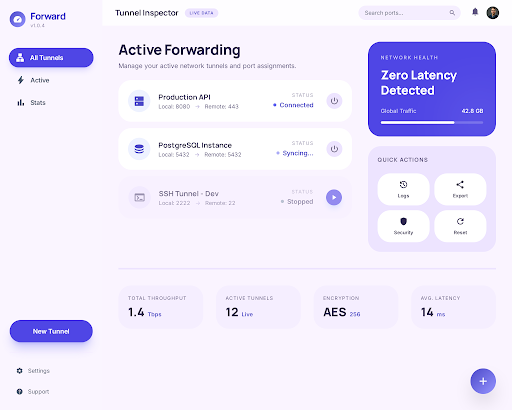
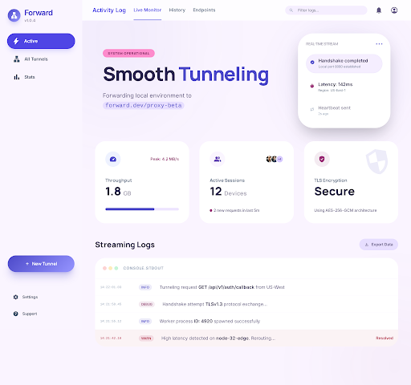
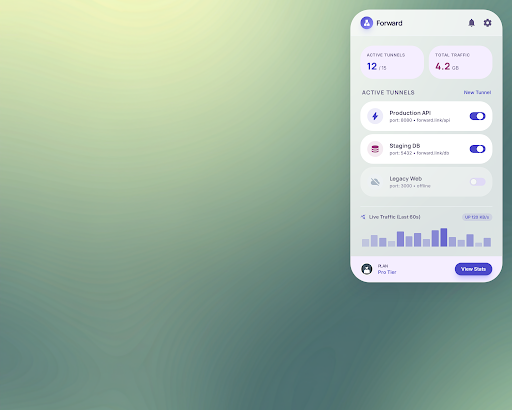
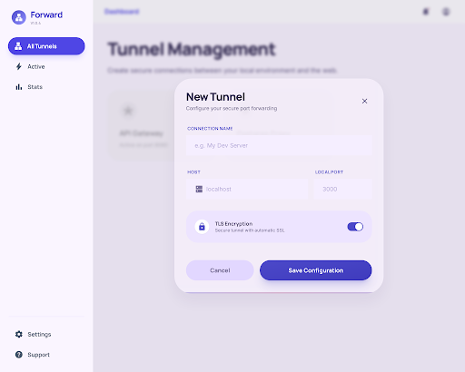

# SSH Tunnel Manager

A macOS menu bar app for managing SSH port forwarding. Configure tunnels, monitor their status, view live logs, and let them auto-reconnect — all from your status bar and a full dashboard.

  

## Screenshots

| Dashboard | Logs |
|-----------|------|
|  |  |

| Menu Bar | Tunnel Configuration |
|----------|---------------------|
|  |  |

## Features

- **Menu bar quick access** — toggle tunnels on/off directly from the dropdown
- **Full dashboard** — dedicated window with tunnel cards, network health panel, and stats
- **Live SSH logs** — streaming log viewer with level filters (Info/Warning/Error), search, and auto-scroll
- **Local, Remote, and Dynamic (SOCKS) forwarding** — `-L`, `-R`, `-D`
- **Auto-reconnect** — exponential backoff (1s -> 60s), with notifications
- **Persistent config** — tunnels survive app restarts
- **Minimal setup** — only 4 fields needed: name, host, local port, remote port
- **Status at a glance** — menu bar icon color shows tunnel health
- **Keychain integration** — passwords stored securely, never in config files
- **Launch at login** — optional, via System Settings
- **Per-tunnel metrics** — uptime, reconnect count, and error tracking

## Install

### From source

Requires Xcode 15+ and [XcodeGen](https://github.com/yonaskolb/XcodeGen).

```bash
git clone https://github.com/LeiShi1313/ssh-tunnel-manager.git
cd ssh-tunnel-manager
brew install xcodegen
xcodegen generate
xcodebuild -project SSHTunnelManager.xcodeproj -scheme SSHTunnelManager -configuration Release build
```

Then copy the built app to Applications:

```bash
cp -R ~/Library/Developer/Xcode/DerivedData/SSHTunnelManager-*/Build/Products/Release/SSHTunnelManager.app /Applications/
```

## Usage

1. Click the network icon in your menu bar
2. Click **Dashboard** to open the full window
3. Click **New Tunnel** in the sidebar
4. Fill in: **Name**, **SSH Host**, **Local Port**, **Remote Port**
5. Click **Add Tunnel** — it connects automatically

### Menu bar dropdown

The dropdown shows all your tunnels with toggle switches for quick connect/disconnect. Double-click or right-click a tunnel to edit, duplicate, or delete.

### Dashboard

The dashboard provides a full view of your tunnels with:
- Tunnel cards showing connection status and port forwarding details
- Network health panel with active tunnel count
- Stats bar with uptime and encryption info

### Logs

The Logs tab streams live output from your SSH processes:
- Filter by level (All / Info / Warnings / Errors)
- Search across log messages
- Metrics pills showing active tunnels, total entries, and error count

### Status colors

| Icon Color | Meaning |
|------------|---------|
| Gray | No active tunnels |
| Indigo | All tunnels connected |
| Orange | Some tunnels reconnecting |
| Red | One or more tunnels failed |

## How it works

Each tunnel spawns a system `ssh` process with flags like:

```
ssh -N -o ExitOnForwardFailure=yes -o ServerAliveInterval=30 -o ServerAliveCountMax=3 -L 5432:localhost:5432 user@host
```

SSH stderr output is captured via pipes and streamed to the Logs view in real time.

Config is stored in `~/Library/Application Support/SSHTunnelManager/tunnels.json`. Passwords use the macOS Keychain.

## License

MIT
